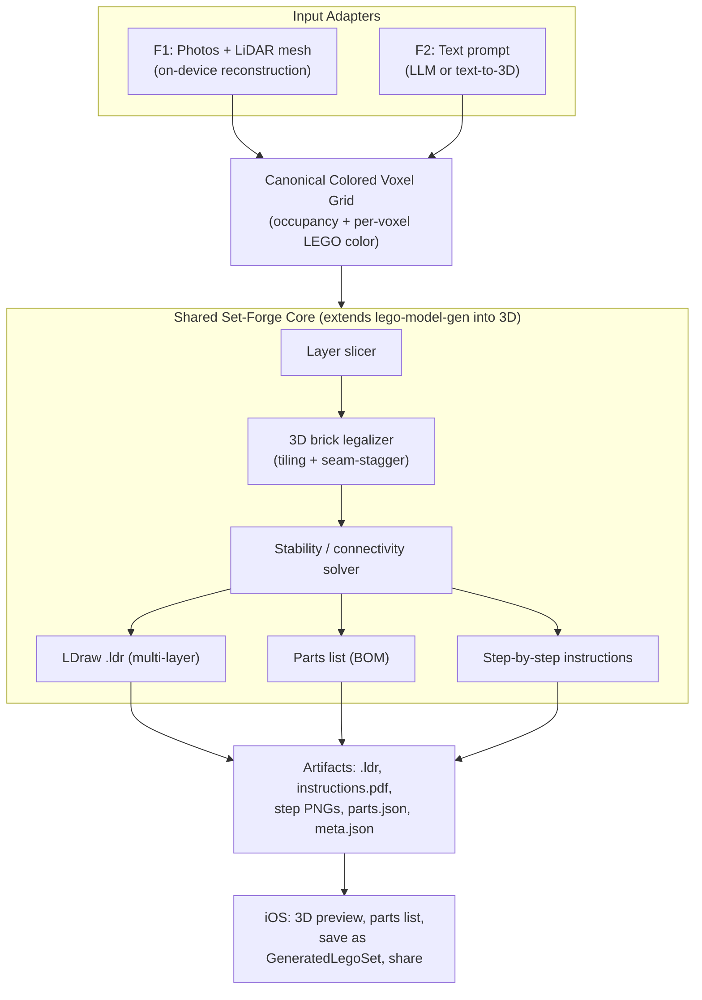
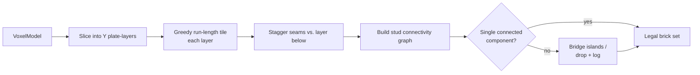
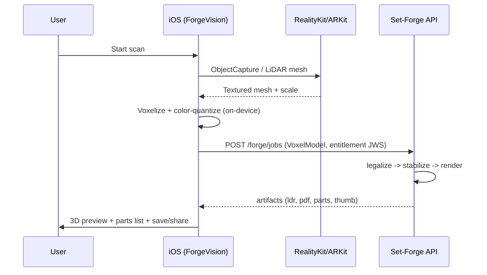
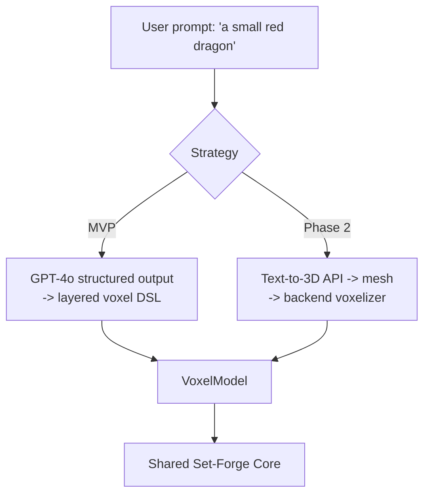

# Bricky "Set Forge" — Generative Buildable LEGO Sets

**Design plan + feasibility assessment** for two generative features that produce
**new, buildable, brick-compatible 3D sets** from a real-world scan (visual input)
or a text description (verbal input). Each generated set includes a complete parts
list (which pieces, which colors, and how many of each) and LEGO-style
step-by-step building instructions.

> This document combines the internal Bricky architecture plan with an external
> feasibility & level-of-effort assessment (July 2026). It is the single source of
> truth for the Set Forge initiative; it supersedes the earlier
> `set-forge-generative-sets.md` draft.

| Feature | Input | Codename |
|---|---|---|
| **F1 — Scan to Set** | Real-world object (camera + LiDAR) | `ForgeVision` |
| **F2 — Describe to Set** | Text description of a subject | `ForgeText` |

---

## 0. Bottom line: feasible, proven, and we have a head start

**This pipeline already exists as a shipping product.** [Brick My World](https://brickmyworld.ai/)
launched on iOS doing exactly F1 (scan → photogrammetry → voxelization →
AI-refined brick layout → parts list → PDF/LDraw instructions), and
[Brickit](https://brickit.app/) proves the adjacent market (scan a pile you own →
build suggestions). The [CMU 2025 paper on generating physically stable and
buildable LEGO from text](https://arxiv.org/html/2505.05469v1) validates F2. So
the **technical risk is low** — every stage has published algorithms, existing
platform APIs, or open-source tooling. Nothing here requires new science.

The difficulty is not *whether* it works but *how well*. Roughly **70% of the real
effort concentrates in two stages: brick-layout optimization ("legolization") and
instruction quality** — not the scanning, which sounds hardest but is now largely
solved by platform APIs.

**Bricky's advantage:** unlike an indie starting from zero, we already own most of
the surrounding machinery — a modular model-generation backend, an LDraw export +
parts-aggregation pipeline, an AI vision proxy with billing/quota/entitlement,
ARKit + LiDAR capture, and the iOS job-client + subscription patterns. Set Forge is
largely an *extension* of `lego-model-gen` from 2D mosaics into 3D, not a
greenfield build. That materially compresses the effort estimates below.

### Level of effort (industry baseline vs. Bricky)

| Scope | Indie baseline (from scratch) | Bricky (reusing existing infra) |
|---|---|---|
| Prototype: scan → crude 3D brick model + parts list + layer PDF | 4–8 weeks, 1 dev | **Shorter** — LDraw/parts/instructions/job infra already exist; mainly add 3D voxelize + packer |
| Solid consumer feature (stable models, good instructions) | 6–12 months, 2–4 people | **Compressed** — reuse client, gating, artifacts; focus effort on the legolizer + instruction renderer |
| Polished + buyable parts lists (BrickLink) | 12+ months, small team | BrickLink XML export already exists; wanted-list is incremental |

Where the effort actually goes (both paths agree):

| Stage | Difficulty | Notes |
|---|---|---|
| 1. Scan → mesh | Easy, mostly solved | Apple Object Capture / LiDAR; days–weeks |
| 2. Mesh → voxels | Easy | Textbook geometry; days |
| 3. Voxels → brick layout ("legolization") | **Hard core** | Merge into standard bricks, interlock layers, structural repair, part-count control; person-months |
| 4. Parts list w/ quantities | Trivial once 3 exists | Inventory of the layout; LDraw export gives BrickLink pricing for free |
| 5. Step-by-step instructions | Moderate, deceptively fiddly | Layer-by-layer is easy; *feeling like real LEGO instructions* is real 3D/UX work |

---

## 1. Architecture at a glance

The key architectural insight: **both features converge on the same intermediate
representation** — a **colored 3D voxel grid** — which flows through one shared
*"Voxel → Buildable LEGO Set"* backend. F1 and F2 differ only in the *front adapter*
that produces that voxel grid. This is deliberately unlike the existing Mosaic
Studio, which is flat / single-layer; Set Forge is genuinely 3D and multi-layer.



### Existing infrastructure this builds on

- **`services/lego-model-gen`** (Python/FastAPI) — already does *2D single-layer*
  photo→mosaic via a clean modular pipeline (`vision → palette/colorspace →
  packing → ldraw → parts → instructions → jobs → storage → api`), job-based
  async, artifact publishing. **Set Forge extends this into 3D.**
- **`services/recognition-proxy`** (Azure Functions/TS) — GPT-4o vision
  (`recognizeImage`, `identifySet`), Pro-gated by Apple StoreKit entitlement JWS,
  quota-enforced, ~$0.005/call. **F2 adds `forgeFromText` here.**
- **iOS client patterns** — `MosaicGenerationService` (actor: submit→poll→download),
  `MosaicGeneratorViewModel`, `MosaicGeneratorView`, `MosaicJob` DTOs, `AppConfig`
  base-URLs, `SubscriptionManager` gating.
- **Domain models** — `LegoProject` / `RequiredPiece` / `BuildStep` /
  `PieceDimensions` / `LegoColor`, bundled LDraw geometry (1 stud = 20 LDU),
  BrickLink XML export.
- **Device sensors** — ARKit world tracking + LiDAR mesh already wired in.
- **Constraint** — $200 cloud cap; prefer pay-per-use / on-device, no always-on GPU.

---

## 2. The Shared Core: Voxel → Buildable LEGO Set

~70% of the work, reused by both features. Implemented by **extending
`services/lego-model-gen`** with a parallel 3D pipeline (`vision` / `packing` /
`instructions` today are 2D; we add `voxelize.py`, `packing3d.py`, `stability.py`,
and extend `ldraw.py` / `instructions.py`).

### 2.1 Canonical intermediate representation

```jsonc
// VoxelModel — the contract both adapters must produce
{
  "resolution": [W, H, D],          // grid dims in studs (X,Z) and plate-layers (Y)
  "voxels": [                        // sparse occupancy
    { "x": 3, "y": 0, "z": 5, "color": "brightRed" }
  ],
  "palette": ["brightRed","white"],       // LEGO color keys used
  "unit": { "studXZ": 20, "plateY": 8 },  // LDU; 1 brick = 3 plate-layers
  "seed": 1234,                     // determinism
  "meta": { "source": "vision|text", "subject": "..." }
}
```

- **Grid convention:** X/Z in studs, Y in *plate* layers (LDU 8 each; a standard
  brick = 3 plates). Note the real-world aspect ratio — a 1×1 brick is **1.2× taller
  than it is wide** in stud units; the voxelizer must account for this so scanned
  proportions survive. Plate-layer granularity gives finer vertical detail and lets
  the legalizer choose bricks vs. plates.
- **Color:** each voxel carries a resolved `LegoColor` key. Nearest-palette
  quantization (reuse `colorspace.py` CIELAB nearest-color + `palette.py`) snaps to
  the **~40 commonly available LEGO colors**.

### 2.2 Brick legalization — the hard core

Naively filling a shape with 1×1 bricks yields a model that is absurdly expensive
and falls apart. This is the well-studied **legolization** problem; we implement
known techniques rather than invent. The existing mosaic packer (`packing.py`) does
2D greedy run-length tiling into 1×1–1×4 plates — we extend to 3D:

1. **Per-layer tiling** — run the run-length tiler on each Y-layer's occupancy
   mask, expanding the brick catalog to standard bricks (1×1…2×N, 1×N, corners) and
   choosing brick vs. plate height by merging 3 consecutive plate-layers of equal
   color/occupancy.
2. **Seam staggering (interlocking)** — real masonry offsets vertical seams for
   strength. After tiling layer *n*, penalize tile boundaries coinciding with layer
   *n−1* seams (shift the greedy start offset, or a second pass that swaps adjacent
   tiles to break aligned seams). This is what makes the model *hold together*
   rather than delaminate.
3. **Connectivity graph** — nodes are bricks; edges are stud / anti-stud overlaps
   between adjacent layers. Require a **single connected component**; if flood-fill
   finds islands, bridge them (add a support brick) or drop the smaller island and
   log it.
4. **Overhang / support** — a voxel with no brick directly below is an overhang.
   MVP forbids overhangs during voxelization (fill-below / morphological close), so
   every brick rests on the one under it. Phase 2 allows limited overhangs backed by
   SNOT / bracket parts.



**Algorithm choice — greedy first, optimize later.** The MVP uses the greedy
tiler + seam-stagger + connectivity repair above (fast, deterministic, testable).
The research literature offers stronger legalizers we can graduate to behind the
same `VoxelModel` → brick-set interface:

- [Legolization via force-based stability analysis (EPFL, Eurographics 2013)](https://infoscience.epfl.ch/bitstreams/ddb0ffd4-97c5-4762-aeeb-1d1d79aa397e/download)
  — replace the COM heuristic (2.3) with a proper force/stress model that repairs
  weak regions.
- [Optimal LEGO brick layout via genetic algorithm](https://www.researchgate.net/publication/300228316_Finding_an_Optimal_LEGOR_Brick_Layout_of_Voxelized_3D_Object_Using_a_Genetic_Algorithm)
  — a drop-in stronger optimizer when greedy part-counts are too high.
- [Legorization with multi-height bricks from silhouette-fitted voxelization](https://dl.acm.org/doi/10.1145/3095140.3095180)
  — informs 2.1 (multi-height brick selection) and B.2 (silhouette-preserving voxelization).
- [Generating physically stable and buildable LEGO from text (CMU, 2025)](https://arxiv.org/html/2505.05469v1)
  — directly relevant to F2 (see §4).
- Open-source prior art: [brick-optimization-builder (Maya plugin)](https://github.com/dzungpng/brick-optimization-builder).

### 2.3 Stability solver (invariants, enforced by tests)

- **No floating bricks** — every brick (except layer 0) has ≥1 stud connection below.
- **Single component** — flood fill over the connectivity graph covers 100% of bricks.
- **Center-of-mass sanity** — projected COM lies within the layer-0 footprint
  (won't topple). *Upgrade path:* EPFL force-based analysis for cantilevers/overhangs.
- **Brick budget** — total parts ≤ the size preset (see 2.5); if exceeded,
  auto-downsample the grid and re-run.
- These become **pytest invariants** on every generated model (mirrors the existing
  determinism / consistency suite). We never ship an un-buildable model — honest
  failure over fake output.

### 2.4 Outputs (artifacts)

Reuse the existing artifact / job / storage machinery. Per job:

| Artifact | How |
|---|---|
| `model.ldr` | Extend `ldraw.py` — emit bricks at `(x*20, -y*8, z*20)` LDU with matched LDraw part + color code. **LDraw is the interop key**: it unlocks BrickLink Studio, LDView, and LPub3D for free. |
| `parts.json` (BOM) | Reuse `parts.py` aggregation by (part, color) with LDraw / BrickLink / Rebrickable IDs; add total count + est. cost. LDraw → **BrickLink availability, pricing, and a buyable wanted-list**. |
| `instructions.pdf` + `stepNN.png` | Extend `instructions.py`: **layer-by-layer** steps, sub-stepped when a layer exceeds N bricks (Strategy C in `INSTRUCTIONS_GENERATOR.md`). Each step renders an **isometric** view with new bricks highlighted. **Shortcut:** [LPub3D](https://sourceforge.net/projects/lpub3d/) can generate instruction pages directly from the `.ldr` — evaluate as a fast path vs. our own renderer. |
| `thumbnail.png` | Isometric hero render. |
| `meta.json` | dims, part count, difficulty, palette, seed, subject. |

**Step rendering:** MVP renders isometric views with a lightweight offscreen
renderer (matplotlib 3D voxels or `pythreejs` / `vtk` headless — no GPU), or LPub3D
from the `.ldr`. Phase 2 swaps in LDView / Blender headless for photoreal renders if
we move to a GPU-capable worker.

### 2.5 Quality controls / presets

- **Size presets** → brick budget + grid cap: `Small ≈ 300–600`,
  `Medium ≈ 800–1,800`, `Large ≈ 2,500–4,500` parts. Enforced by 2.3 auto-downsample.
- **Hollow interiors** for large models to keep part count and cost sane.
- **Palette selection:** default "classic ~40-color", optional "monochrome" /
  "your inventory only" (intersect with the user's `InventoryStore` to compute
  *buildable-with-what-you-own* %, exactly like `BuildSuggestionEngine.matchPercentage`).
- **Deterministic seed** for reproducibility + testability.

### 2.6 New backend API

Extend the existing FastAPI job API with a 3D job type (keeps mosaic and set-forge
under one deployable service):

| Method | Path | Purpose |
|---|---|---|
| POST | `/forge/jobs` | Create set-forge job. Body = `VoxelModel` **or** `{ "prompt": "..." }` (F2) **or** multipart photos+mesh (F1 server path). Includes size preset, palette, seed. |
| GET | `/forge/jobs/{id}` | Poll status / progress (`queued→reconstruct→voxelize→legalize→stabilize→render→done`). |
| GET | `/forge/jobs/{id}/result` | Artifact URLs. |
| GET | `/artifacts/{id}/{name}` | Download (existing). |

---

## 3. Feature F1 — Scan to Set (`ForgeVision`)

Turns a real-world object into a voxel grid. **Prefer on-device reconstruction**
(free, private, honors the cost cap). This is the exact pipeline Brick My World
ships, so the risk is low.

### 3.1 Capture & 3D reconstruction (iOS 17+)

- **LiDAR devices (Pro iPhones/iPads)** — **ARKit scene mesh** (`ARMeshAnchor`,
  already in the app's ARKit stack) *or* RealityKit **Object Capture**
  (`ObjectCaptureSession`, iOS 17) for a guided turntable scan → textured mesh +
  point cloud with real-world scale.
- **Non-LiDAR devices** — **PhotogrammetrySession** (RealityKit) from ~20–40 photos
  → mesh, as a background `Task.detached`.
- **Android (future) / weak devices** — cloud photogrammetry, or AI image-to-3D
  (Meshy / Tripo) from a handful of photos. This is why the industry ships iOS-first
  with "Android coming soon"; Bricky follows the same sequencing.

Guided capture UX: an AR coaching overlay ("walk around the object", coverage dome
fills in) reusing existing `ARCameraManager` patterns + the scan-coordinator phase
state machine.

### 3.2 Mesh → colored voxel grid (on-device)

1. **Normalize & orient** — center mesh, PCA-align principal axis to Y-up, scale so
   the longest axis = target stud count for the chosen size preset (respect the 1.2×
   brick-height aspect ratio).
2. **Voxelize** — surface voxelization + interior flood-fill (hollow option to save
   parts). Optionally silhouette-fit (2.2 refs) to preserve the recognizable shape.
3. **Color sampling** — sample mesh texture / vertex color per surface voxel → CIELAB
   → nearest LEGO palette color. MVP quantizes **server-side** to keep one source of
   truth (`colorspace.py`); a Swift `LegoColorQuantizer` port is an optional on-device
   optimization.
4. **Morphological cleanup** — close 1-voxel holes, remove floating specks, apply the
   "no-overhang" fill so the legalizer always succeeds.

Result: a `VoxelModel`, produced **entirely on-device**; the backend only runs
legalization + rendering.



### 3.3 On-device vs. cloud compute

The industry norm runs the heavy compute (photogrammetry cleanup, layout
optimization) **in the cloud**. Bricky splits it: **reconstruction + voxelization
on-device** (free, private, offline-capable — aligns with our offline-first rule and
$200 cap), **legalization + rendering in Flex Consumption** (bounded CPU, pay-per-use).
Server-side photogrammetry remains a Phase-2 fallback for old / Android devices.

---

## 4. Feature F2 — Describe to Set (`ForgeText`)

Turns a text prompt into a voxel grid. Two strategies, shipped in order. The
[CMU 2025 result](https://arxiv.org/html/2505.05469v1) shows text → *stable,
buildable* LEGO is a solved research problem, not speculation.

### 4.1 Strategy 1 — LLM-authored build spec (MVP, cheap, no GPU)

Reuse the **recognition-proxy** GPT-4o path. New function `forgeFromText` with a
structured-output prompt that returns a compact **voxel DSL** directly, not free-form 3D:

- Output JSON conforms to a *layered* schema — an array of Y-layers, each a small
  run-length-encoded 2D color grid — bounded to the size preset's grid dims (a
  "Small" model is a ≤16×16×16 grid the LLM can actually author).
- **Structured Outputs / JSON schema** guarantees parseable output; validate against
  the `VoxelModel` contract and reject / repair malformed grids (same "never
  fabricate, honest failure" discipline as the recognition prompt).
- LLMs are *good* at coarse blocky shapes (house, tree, dog, spaceship) at 16³–24³ —
  exactly LEGO-appropriate. It's essentially "author a Minecraft-style build."
- **Cost:** one GPT-4o call, ~$0.01–0.05/gen. Gated + quota'd like `recognizeImage`.

### 4.2 Strategy 2 — Text-to-3D generative model (Phase 2, higher fidelity)

- **Pay-per-use API** (Meshy / Tripo3D) or **serverless GPU** (Replicate / Modal
  running Shap-E / TripoSR / Trellis) — *never* always-on GPU.
- Output mesh → the **same backend voxelizer** from §2/§3 → `VoxelModel`.
- Hard per-user quota + a global spend guard (extend the recognition-proxy quota
  table). Enable only after cost validation under the cap.

Strategy 1 ships first (cheap, GPU-free, reuses infra); Strategy 2 is a quality
upgrade behind the same UI.



---

## 5. iOS Client (shared)

Mirror the proven Mosaic Studio client layer. New files, following existing MVVM +
actor-service patterns:

**Models**
- `Models/GeneratedLegoSet.swift` — forged-set DTO: name, subject, size, part count,
  difficulty, `[RequiredPiece]` (reuse), artifact URLs, on-device brick placements
  for 3D preview. Bridges to existing `LegoProject` / `BuildStep` so forged sets flow
  into the *existing* build-instructions UI and inventory match %.
- `Models/VoxelModel.swift` — canonical grid DTO (Codable), plus `ForgeJob` /
  `ForgeResult` mirroring `MosaicJob`.

**Services**
- `Services/SetForgeService.swift` — `actor` API client (submit / poll / fetch /
  download), mirrors `MosaicGenerationService`; base URL via `AppConfig`.
- `Services/MeshVoxelizer.swift` — on-device mesh→`VoxelModel` (F1), RealityKit / ModelIO.
- `Services/LegoColorQuantizer.swift` (optional) — Swift color snap if quantizing on-device.

**ViewModels**
- `ViewModels/ForgeVisionViewModel.swift` — capture → reconstruct → voxelize → submit → poll → result.
- `ViewModels/ForgeTextViewModel.swift` — prompt → submit → poll → result.

**Views**
- `Views/SetForgeHomeView.swift` — two cards ("Scan an Object", "Describe an Idea").
- `Views/ForgeVisionCaptureView.swift` — AR guided capture (reuses `ARCameraManager`).
- `Views/ForgeTextView.swift` — prompt field (**capped width** per UI standards —
  `.frame(maxWidth: 480).frame(maxWidth: .infinity)`), size / palette pickers, examples.
- `Views/GeneratedSetView.swift` — **SceneKit / RealityKit 3D preview** from brick
  placements (reuses bundled LDraw geometry / existing `ModelViewerView`), parts list,
  step-by-step instructions (reuse existing instruction UI), buildable-with-your-inventory %,
  save-to-collection, share sheet (PDF / parts / `.ldr`), BrickLink XML export (reuse existing exporter).

**Config / gating**
- `AppConfig.setForgeApiBaseURL` (UserDefaults + env, like `mosaicApiBaseURL`).
- **Pro feature** via `SubscriptionManager`; free tier gets 1 trial forge (paywall after).
  Quota enforced server-side by entitlement JWS (reuse `entitlement.ts` + quota table).
- Persist forged sets through `InventoryStore` / a new `GeneratedSetStore`
  (iCloud-synced). Catalogs stay read-only.

---

## 6. Testing (non-negotiable)

**Swift (XCTest, `@MainActor` where needed)**
- `MeshVoxelizerTests` — occupancy correctness, hole-fill, color snap on fixtures.
- `SetForgeServiceTests` — submit / poll / result with a mocked URLProtocol (no network).
- `ForgeVision/ForgeTextViewModelTests` — state transitions, error / empty / paywall paths.
- `GeneratedLegoSetTests` — Codable round-trip; bridge to `LegoProject` / inventory match %.

**Python (pytest, extend existing determinism suite)**
- `test_voxelize` — mesh→grid invariants (incl. 1.2× aspect ratio).
- `test_packing3d` — tiling covers every voxel exactly once; seam-stagger reduces aligned seams.
- `test_stability` — **no floating bricks**, single connected component, COM within footprint.
- `test_instructions3d` — every brick in exactly one step; step count deterministic per seed.
- `test_forge_text_schema` — LLM DSL validates / repairs against `VoxelModel`.

**TypeScript (node:test, extend recognition-proxy suite)**
- `forgeFromText` — schema validation, entitlement gating, quota enforcement, honest-empty on refusal.

---

## 7. Cost & Infrastructure (respects $200 cap)

| Path | Where it runs | Marginal cost |
|---|---|---|
| F1 reconstruction + voxelization | **On device** | $0 |
| F1/F2 legalize + instruction render | Flex Consumption (CPU, pay-per-use), extends `lego-model-gen` | ~fractions of a cent (CPU-seconds) |
| F2 MVP (LLM DSL) | recognition-proxy GPT-4o | ~$0.01–0.05/gen |
| F2 Phase 2 (text-to-3D) | Pay-per-use API / serverless GPU **with hard cap** | gated, quota'd, off by default |

No always-on GPU. Reuse existing Function App + storage + Key Vault +
entitlement / quota. Add a global spend guard before enabling Strategy 2. Note: if a
future high-fidelity legalizer (genetic / force-based) proves too heavy for Flex
Consumption CPU limits, budget for a bounded serverless-CPU worker rather than
always-on compute.

---

## 8. Non-technical caveats

### 8.1 Trademark / IP — brand as "brick-compatible"

The basic brick shape is off-patent (hence the clone-brick market), but the **LEGO®
name and trade dress are fiercely protected**. Set Forge output and marketing must:

- Describe generated models as **"brick-compatible"**, never as official LEGO sets.
- Avoid using "LEGO" in feature names / titles (note Brick My World and Brickit both
  avoid it). Bricky's own naming already leans this way — keep Set Forge copy
  consistent (e.g. "brick model", "brick-compatible set", "studs").
- Use generic part geometry/IDs (LDraw / BrickLink part numbers are fine as
  references) and avoid implying LEGO Group endorsement.

### 8.2 Output-quality expectations — set them honestly in-app

Automated legolization produces **studded, voxel-y, "Minecraft-looking"** models.
Real LEGO designers use slopes, curves, SNOT, and specialized parts; closing that
gap is an **open research problem**, not an engineering task. That's fine for a fun
consumer feature — but the UI should frame results as playful brick renditions, offer
size/detail controls, and let users regenerate, rather than promising
designer-quality sets. Manage expectations to protect trust (consistent with our
"no fake/overpromised output" rule).

---

## 9. Delivery milestones

1. **M1 — Shared Core (backend):** `voxelize` / `packing3d` / `stability`, LDraw 3D
   emit, layer-by-layer instructions (evaluate LPub3D shortcut), `/forge/jobs` API +
   pytest invariants. *(Unblocks everything.)*
2. **M2 — F2 MVP (`ForgeText`):** `forgeFromText` GPT-4o DSL + iOS `ForgeText` UI +
   3D preview + save / share. Cheapest end-to-end validation.
3. **M3 — F1 (`ForgeVision`):** on-device Object Capture / LiDAR → `MeshVoxelizer` →
   same core; guided AR capture UX.
4. **M4 — Polish:** inventory-aware palette + buildability %, BrickLink wanted-list
   export, difficulty scoring, paywall / quota, "brick-compatible" branding pass,
   docs (`features.md`, help center, `CHANGELOG`, `VERSION`).
5. **M5 — F2 Phase 2 + legalizer upgrade:** optional text-to-3D generative path and
   stronger legolizer (genetic / EPFL force-based) behind the same interface +
   spend guard.

---

## 10. Key risks & mitigations

- **Buildability / stability** — legalizer + stability invariants (no floating
  bricks, single component, COM/force check) enforced by tests; auto-downsample
  rather than ship an un-buildable model. Honest failure over fake output.
- **Part-count blowout** — greedy tiler may over-count; size presets + hollowing +
  (Phase 2) genetic/force-based optimizer keep counts sane.
- **LLM voxel quality (F2 MVP)** — bound resolution to what GPT-4o authors well
  (≤24³), validate + repair schema, offer regenerate; Strategy 2 is the fidelity path.
- **On-device reconstruction on old / Android hardware** — PhotogrammetrySession
  fallback; cloud photogrammetry / AI image-to-3D as Phase-2 safety net.
- **Instruction fidelity** — start with isometric renders / LPub3D; upgrade to
  headless LDraw renders later without changing contracts.
- **Expectation gap** — "Minecraft-y" output framed honestly in UI (§8.2).
- **IP** — strict "brick-compatible" branding, no "LEGO" in names (§8.1).

---

## Prior art & references

| Product / Tool | Relevance |
|---|---|
| [Brick My World](https://brickmyworld.ai/) ([coverage](https://www.coolthings.com/brick-my-world-app-scans-objects-into-3d-lego-models/)) | Proves F1 end-to-end on iOS (scan → voxelize → AI-refine → parts + PDF/LDR). |
| [Brickit](https://brickit.app/) | Proves the adjacent market (scan a pile → build suggestions). |
| [LEGO Builder](https://www.lego.com/en-us/builder-app) | UX benchmark for instruction quality. |
| [Drububu Legolizer](https://drububu.com/miscellaneous/legolizer/index.html) | Free web legolizer reference. |
| BrickLink Studio / LDraw / [LPub3D](https://sourceforge.net/projects/lpub3d/) | CAD + instruction-generation ecosystem we export into. |
| [EPFL force-based stability (2013)](https://infoscience.epfl.ch/bitstreams/ddb0ffd4-97c5-4762-aeeb-1d1d79aa397e/download) | Upgrade path for the stability solver (§2.3). |
| [Genetic-algorithm brick layout](https://www.researchgate.net/publication/300228316_Finding_an_Optimal_LEGOR_Brick_Layout_of_Voxelized_3D_Object_Using_a_Genetic_Algorithm) | Stronger legalizer (§2.2). |
| [Silhouette-fitted multi-height voxelization](https://dl.acm.org/doi/10.1145/3095140.3095180) | Voxelization + multi-height bricks (§2.1, §3.2). |
| [Text → stable buildable LEGO (CMU, 2025)](https://arxiv.org/html/2505.05469v1) | Validates F2 (§4). |
| [brick-optimization-builder](https://github.com/dzungpng/brick-optimization-builder) | Open-source legolization reference. |

---

## Changelog

2026-07-09 · main · **3D preview interaction fixed + all captured frames viewable.** (1) The 3D model preview couldn't be rotated/zoomed because `BrickModelSceneView` rebuilt its whole scene on every SwiftUI update, snapping the camera back each time — added a `Coordinator` that fingerprints the bricks and rebuilds only on real change, so the user's orbit/zoom persists. Added an `interactive` flag (thumbnails opt out). Added a **full-screen `Model3DViewerView`** (tap the expand button on the preview) where, free of the enclosing `ScrollView`, drag-to-rotate / pinch-to-zoom / two-finger-pan all work cleanly. (2) `GeneratedSetStore` now stores **all** captured frames (`save(_:sourceImages:)`, `sourceImages(for:)`, capped at 4, indexed `<id>-<n>.jpg`, full delete cleanup) — a single photo, the 4 angle photos, or the 4 video-sweep frames actually used. The result screen shows a tappable strip of every captured angle ("Captured Angles (N)") opening a zoomable, swipeable `ImageViewerView`. For the walk-around only the 4 downselected frames are persisted (the video itself is never saved). 5 store/mesh tests added/updated (21 pass); build OK.

2026-07-09 · main · **Fixed "3D scan looks nothing like the subject" — the mesh voxelizer ignored textures.** Hosted meshes (Tripo image/multiview, Object Capture) are **UV-textured**, not vertex-colored, and their material base color is a `.texture` (not a `float3`), so `MeshVoxelizer` was falling back to a flat gray for every triangle — the brick model came out as a uniform gray blob regardless of the real object's colors. Added base-color **texture sampling**: `MeshVoxelizer` now reads per-vertex UVs (`MDLVertexAttributeTextureCoordinate`), decodes each base-color texture once into an RGBA8 bitmap (`TextureSampler`, cached per texture), and samples the subject's actual colors per vertex (UV wrap + V-flip for USD's bottom-left origin), interpolated across each triangle. Falls back to per-vertex color → flat material color → gray only when no texture exists. This affects **every** cloud 3D path (single photo, 4-angle, walk-around) plus imported textured models. Also switched the nearest-pixel mapping from `*(w-1)` to `*w` (standard, cleaner). 2 new sampler tests + all 7 MeshVoxelizer tests pass; build OK. Note: shape fidelity still depends on capture quality, Tripo, and the chosen size — larger sizes (Medium/Large) resolve more detail.

2026-07-09 · main · **Video sweep is now user-ended (was auto-stopping at 6s).** `VideoSweepCapture` no longer auto-completes on a timer — it captures views continuously until the user taps **Finish Scan**. Added `finishSweep()` + `canFinish` (needs `minFramesToFinish = 4` so a scan always has enough angles); the coverage ring now fills toward a soft target (16 frames) purely as guidance and never ends the sweep. `VideoSweepCaptureView` shows a "Finish Scan" button (disabled → "Keep Scanning…" until 4 views), a live captured-count with a "keep going" hint, and updated coaching ("walk around the subject — capture every side, then tap Finish"). Fixes the walk-around ending before the user had captured the back/right sides. Build OK; device-only.

2026-07-09 · main · **Made the 3D scan UI discoverable + added guided angle capture.** The multi-angle path existed only as a low, library-only "pick up to 4 photos" picker, so users couldn't find how to shoot front/left/back/right or walk around. Restructured `ScanToSetView`: a prominent **"Scan in 3D (Recommended)"** card is now the first thing after the header, offering three clear modes — **Photograph 4 Angles** (new guided camera flow), **Record a Walk-Around** (the video sweep), and **Pick 4 Photos from Library** — with the single-photo flow demoted to an "Or use a single photo" card below. New `GuidedAngleCaptureView` (front→left→back→right shutter capture, per-angle prompts, thumbnails, retake-last) grabs stills from the shared `VideoSweepCapture` session via a new continuously-updated `latestFrame`. Both camera flows feed `generateFromImages` (multiview → 3D). iOS-only; build succeeded. Camera capture is device-only (not runnable in Simulator).

2026-07-09 · main · **Live video-sweep capture + 3 result-screen upgrades.** (1) `VideoSweepCapture` (AVCaptureSession + throttled `AVCaptureVideoDataOutput`, 6s orbit, `OSAllocatedUnfairLock`, testable `selectViews(from:count:)` even-spaced downselect) + `VideoSweepCaptureView` (coaching + progress ring); wired a **"Record a 3D Sweep"** button into Scan to Set that feeds the frames into the multiview → 3D pipeline (Pro-gated). (2) **3D per-step instructions** — `SetForgeInstructions.stepGroups(for:)` (index-aligned with `steps`), `BrickModelSceneView` gains a `highlightCount` (new bricks glow, prior bricks ghosted); `InstructionStepsView` now renders a rotatable cumulative 3D render per step like a printed LEGO manual. (3) **Scan history saves the original image + set** — `GeneratedSetStore.save(_:sourceImage:)` persists the source JPEG (retrieved via `sourceImage(for:)`, cleaned up on delete/evict); a new **My Forged Sets** gallery (`GeneratedSetsGalleryView`, scanned-image→build thumbnails, swipe-delete) with an entry point on the Scanner screen; the result screen shows the scanned subject beside the build. (4) **Honest model-quality badge** — `GeneratedLegoSet.Generator` (`.hd` / `.ai` / `.onDevice`) threaded from both view models through `SetForgeEngine.generate(…generator:)`, shown on the preview + gallery so a Tripo HD 3D result is distinguishable from an on-device relief. iOS-only (no backend/deploy). Build succeeded; 12 new `SetForgePolishTests` pass (step-group alignment/coverage, generator threading + Codable, source-image persistence + delete cleanup, sweep downselect). Camera/live-capture is compile-verified only — device runtime verification pending.

2026-07-09 · main · **Multi-angle 3D scan** (true 3D from all sides). Backend adds Tripo `multiview_to_model` through the provider abstraction (`MeshProvider.forgeFromMultiview` → upload up to 4 views [front/left/back/right] → draft → convert USDZ) + `forgeMeshFromMultiview` function; 72 TS tests pass; deployed + smoke-verified. iOS: `ForgeVisionViewModel.generateFromImages([UIImage])` (multiview tier → single-photo relief fallback), `AzureTripoMeshClient.generateMesh(images:…)`, `AppConfig.forgeMeshFromMultiviewEndpoint`, and a **"Scan in 3D (multiple angles)"** multi-photo picker (up to 4) in Scan to Set. Also fixed the flat single-photo preview: `PhotoVoxelizer` now builds a **distance-transform bas-relief** (subject bulges into 3D) instead of a flat slab. 32 iOS Set Forge tests pass. Live video-sweep capture UI is the device-only follow-up. (Still pending from the prior list: 3D per-step instructions, save original image to history, HD-source label.)

2026-07-09 · main · Added **STL 3D-printer export** for every generated set. `SetForgeSTLExporter` writes each `PlacedBrick` as a solid box (12 tris) in binary STL at real-world LEGO scale (1 stud = 8mm, 1 layer = 9.6mm); deterministic. New "Export for 3D Printing (STL)" button in `GeneratedSetView` (writes `<name>.stl` → share sheet). On-device, works for cloud and offline sets alike. 4 STL tests pass. (Distinct from the LDraw `.ldr` brick-CAD export and the parts list / step instructions.)

2026-07-09 · main · Image→3D routed through the provider abstraction. `MeshProvider` gains `forgeFromImage`; Tripo impl uploads the photo (`/upload/sts` → image_token), runs `image_to_model` → convert to USDZ. New `forgeMeshFromImage` function (same entitlement + quota + global spend guard, provider-agnostic via `MESH_PROVIDER`). iOS `ForgeVisionViewModel` (Scan to Set) now tries hosted image→3D first → `MeshVoxelizer`, falling back to the on-device photo relief. `SetForgeMeshService` + `AzureTripoMeshClient` extended with the image method (shared forge+download); `AppConfig.forgeMeshFromImageEndpoint` added. 69 TS + 26 iOS Set Forge tests pass. Deployed + smoke-verified (empty→400, bad token→401).

2026-07-09 · main · Set Forge HD tier LIVE + provider-agnostic. Tripo now does draft `text_to_model` → `convert_model` to **USDZ** (so it voxelizes on-device via Model I/O). Backend made **provider-agnostic**: `meshProvider.ts` `MeshProvider` interface + `createMeshProvider(env)` factory keyed by `MESH_PROVIDER` (default `tripo`; Meshy/CSM/Rodin are drop-in `case`s); `forgeMeshFromText` function delegates to the provider. `TRIPO_API_KEY` wired as a **Key Vault reference** to `tripo-api-key` (managed identity resolves it; never in config/binary). Global spend guard `TRIPO_MONTHLY_CAP=500`. Deployed to `bricky-recognition`; validated end-to-end (HTTP 200, real `.usdz` returned, ~71s, quota decremented). 64 TS tests pass. iOS unchanged (already provider-neutral — calls the endpoint, gets `{modelUrl, format}`).

2026-07-08 · main · Set Forge is now a **Pro feature** (on-device generation gated on `isPro`; free users see a PRO badge + paywall on the entry cards and Forge button; per-size gating removed). Wired **Tripo** hosted text→3D as the premium cloud tier: backend `tripo.ts` (create `text_to_model` task → poll `/task/{id}` → best model URL) + `forgeMeshFromText` function with entitlement, per-user quota, and a **global monthly spend guard** (second quota row `__global_tripo__`, cap `TRIPO_MONTHLY_CAP`); 68 TS tests pass. iOS `TripoMeshService` downloads the model → `MeshVoxelizer`; `ForgeTextViewModel` is now a 3-tier cascade (Tripo mesh → GPT voxel DSL → on-device templates), each falling through gracefully. `AppConfig.forgeMeshFromTextEndpoint` added. 26 iOS Set Forge tests pass. Developer-only cloud (cost-controlled) — deploy needs a `TRIPO_API_KEY` app setting; until then the app falls back to GPT/templates.

2026-07-08 · main · Scan 3D groundwork: added `MeshVoxelizer` — solid voxelization (vertical-ray parity with coincident-hit merging) turning any textured mesh into a colored `VoxelModel`; ModelIO loader for `.usdz`/`.obj`/etc. Wired an **Import a 3D Model** path into Scan to Set (`ForgeVisionViewModel.generateFromMesh` + `fileImporter`), so Object Capture output *and* hosted image/text-to-3D API meshes both flow through the on-device brick engine. 5 MeshVoxelizer tests + 44 Set Forge tests pass. NOTE: Apple's guided **Object Capture** (`ObjectCaptureSession`) is device-only and absent from the iOS Simulator SDK, so the in-app guided-capture UI can't be compiled/verified in this environment — it's a device-targeted follow-up. Recommended primary path (budget open): integrate a hosted image+text-to-3D API (Meshy/Tripo) feeding the same `MeshVoxelizer`.

2026-07-08 · main · Phase 2 (Describe): implemented GPT-4o text→voxel path. Backend `services/recognition-proxy` adds `forgeFromText` function + `forge.ts` (layered ASCII voxel DSL → validated/expanded voxels), entitlement + quota gated like `recognizeImage` (49 TS tests pass). iOS adds `SetForgeTextService` (actor client) + `AppConfig.forgeFromTextEndpoint`; `ForgeTextViewModel` now tries the cloud model first (developer-entitled) and falls back gracefully to the on-device `VoxelShapeLibrary` on any failure/offline/no-entitlement. Also raised offline detail: grid caps 12/20/28→20/36/56, budgets 600/1.8k/4.5k→2k/6k/14k, photo relief depth fixed, SceneKit preview flattened. All iOS Set Forge tests pass. NOT yet deployed to Azure (client falls back to templates until `forgeFromText` is deployed).
2026-07-08 · main · Fixed Describe/Scan keyboard: FocusState + Done toolbar + interactive scroll-dismiss + resign-on-generate/navigate/disappear (fixes double-tap Forge and stuck keyboard on return).
2026-07-08 · main · Implemented the M1 shared core + M2/M3 offline vertical slice on-device (Swift, no backend): `VoxelModel`/`GeneratedLegoSet` models; `SetForgeEngine` (VoxelPacker seam-stagger + gravity-settle "no floating bricks" invariant, LDraw 3D export, parts BOM, layer-by-layer instructions); `VoxelShapeLibrary` (18 procedural describe→voxel templates + fallback); `PhotoVoxelizer` (Vision foreground-segmentation photo→voxel relief); `SpeechDictationService` (on-device voice input); `ForgeText`/`ForgeVision` view models; Describe/ScanToSet/GeneratedSet SwiftUI screens with SceneKit 3D preview; two new "Scan to Set" + "Describe a Set" entry points on the Scanner screen. 30 tests pass; app builds clean.
2026-07-08 · main · Created combined Set Forge design + feasibility doc, merging the internal architecture plan with the external feasibility/LOE assessment (prior art, legolization research refs, LPub3D/LDraw ecosystem, brick-compatible branding + output-quality caveats, effort estimates). Supersedes `set-forge-generative-sets.md`.
